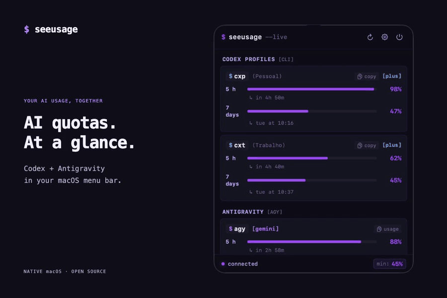

# SeeUsage

A native macOS menu bar app and CLI that monitors and displays, in a single place, the quotas and rate limits across multiple **Codex** profiles (`CODEX_HOME`) and **Antigravity** (`agy`).

<h2 align="center">Demo</h2>

<p align="center">
  <a href="assets/seeusage-demo.mp4">
    
  </a>
</p>
<p align="center">
  Real SeeUsage interface · 13 seconds · <a href="assets/seeusage-demo.mp4">Watch the MP4</a>
</p>

```text
SeeUsage                     ↻  ⚙
Updated just now

CODEX

Personal                      Plus
5 h        █████████░   90%
           Resets in 4h 42m

7 days     ██████░░░░   62%
           Resets Sunday at 20:56

Work                          Plus
5 h        ░░░░░░░░░░    1%
           Resets in 25m

7 days     █████░░░░░   53%
           Resets Sunday at 21:17

ANTIGRAVITY

Gemini
5 h        ██████░░░░   63%
           Resets in 1h 2m
7 days     ████████░░   84%
           Resets Monday at 03:47

Claude and GPT
5 h        ██████████  100%
           Resets in 3h 55m
7 days     ██████████  100%
           Resets Wednesday at 03:40
```

---

## Features

- **Multi-Profile Codex**: Simultaneously queries multiple profiles (`~/.codex-profiles/*` and `~/.codex`) with independent plans without modifying active terminal accounts or touching `auth.json`.
- **Antigravity**: Queries active `agy` CLI credentials (`/usage`), supporting all model families (Gemini, Claude, GPT).
- **Interactive Terminal Dashboard (`seeusage watch`)**: Fullscreen real-time TUI (htop/btop-style) with countdown to the exact second until reset (`Reset in 02:44:19`), interactive hotkeys (`r` to refresh, `t` to cycle themes, `m` to change menu bar mode, `q` to quit), and zero screen flicker.
- **Customizable Menu Bar Item**: Choose between 4 display modes:
  - **Lowest Quota**: Icon + lowest percentage (e.g. `⚡ 47%`).
  - **Dual Quotas**: Codex and Antigravity side by side (e.g. `cx: 92% · ag: 81%`).
  - **Mini Gauge**: High-resolution graphic micro progress bar in the menu bar.
  - **Icon Only**: Minimalist status dot tinted by quota health (Green / Amber / Red).
- **Launch at Login**: Native macOS service (`SMAppService`) toggle to start automatically on login.
- **Native macOS Notifications & Alerts**: Custom system alerts when any quota drops below a critical threshold (e.g. `<= 15%`) and instant alerts when quotas reset and recover back to 100%.
- **Dynamic Themes & Palettes**: Includes 10 customizable terminal themes (Emerald, Ocean, Grove, Iris, Ember, Tokyo Night, Matrix Cyber, Palenight, Dracula, Solarized Dark) with instant live preview.
- **Settings Sidebar Window**: Modern preferences interface to manage profiles, themes, custom executable paths, and polling intervals.
- **Fast CLI Integration**: `seeusage` commands for shell prompts (`--mini`), full status table, themes management, and `CODEX_HOME` switcher scripts.
- **100% Private & Local**: Zero credentials or tokens are saved, copied, or transmitted. No telemetry or external server tracking.

---

## Requirements

- macOS 14.0+ (Sonoma or newer)
- Apple Silicon or Intel
- Codex CLI (`codex`) installed
- Antigravity CLI (`agy`) installed
- Dedicated Conda environment: `seeu` (or system Swift 5.9+)

---

## How It Works

### Codex
SeeUsage temporarily spawns an isolated Codex process for each configured profile:
```bash
CODEX_HOME="/path/to/profile" codex app-server --stdio
```
It communicates via JSON-RPC (`initialize` → `initialized` → `account/rateLimits/read`), extracts session and weekly limits, and immediately terminates the subprocess. No credentials (`auth.json`) are read or modified directly.

### Antigravity
SeeUsage executes the official read-only CLI command:
```bash
agy -p "/usage" --output-format text --print-timeout 30s
```
It parses structured quota lines for each model group and computes remaining percentages without consuming any inference tokens.

---

## Development & Testing

Development and tests run through the `seeu` Conda environment:

```bash
# Activate conda environment
conda activate seeu

# Compile in debug mode
conda run -n seeu swift build

# Run unit tests
conda run -n seeu swift test

# Compile in release mode
conda run -n seeu swift build -c release

# Inspect CLI dashboard
conda run -n seeu swift run SeeUsage
```

---

## Packaging & Installation

### Build macOS App Bundle (`dist/SeeUsage.app`)
```bash
./scripts/build_app.sh
```

### Install into `~/Applications`
```bash
./scripts/install.sh
```

Once installed, launch the application:
```bash
open ~/Applications/SeeUsage.app
```

---

## CLI Usage

```bash
seeusage                     # Full interactive dashboard table
seeusage watch               # Real-time interactive TUI with live second countdown (htop-style)
seeusage settings            # Open preferences window
seeusage themes              # List available themes
seeusage theme ocean         # Activate Ocean theme
seeusage mode                # List menu bar display styles
seeusage mode dual           # Switch menu bar to Dual Quotas (cx + ag)
seeusage notify              # View notification preferences & threshold
seeusage notify test         # Send an instant test notification
seeusage notify 10           # Set critical alert threshold to 10%
seeusage --mini --cached     # Lightweight one-liner for shell prompt (Starship/Zsh)
seeusage --json              # Output metrics formatted as JSON
seeusage --shell-init        # Generate shell wrapper functions for ~/.zshrc
```

---

## Privacy & Security

- **Zero Credential Storage**: SeeUsage never reads, persists, or transmits OAuth tokens, passwords, or authentication keys.
- **Secure Local Delegation**: All data retrieval delegates strictly to official CLI binaries installed on your system.
- **No Telemetry**: No analytics, background trackers, or unauthorized network calls.

---

## Troubleshooting

- **"Codex CLI not found"**:
  Ensure `codex` is installed (e.g. `/opt/homebrew/bin/codex`). You can specify a custom binary path in **Settings → Executables**.
- **"Antigravity CLI not found"**:
  Ensure `agy` is in your PATH (e.g. `~/.local/bin/agy`). You can configure the path in **Settings → Executables**.
- **"Codex profile not authenticated"**:
  Open your terminal and run `CODEX_HOME="/path/to/profile" codex login` to log in.
- **"Log in to Antigravity CLI"**:
  Run `agy` in your terminal to authenticate.
